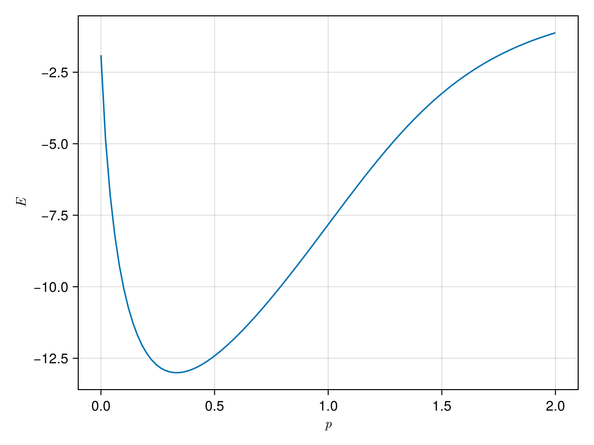
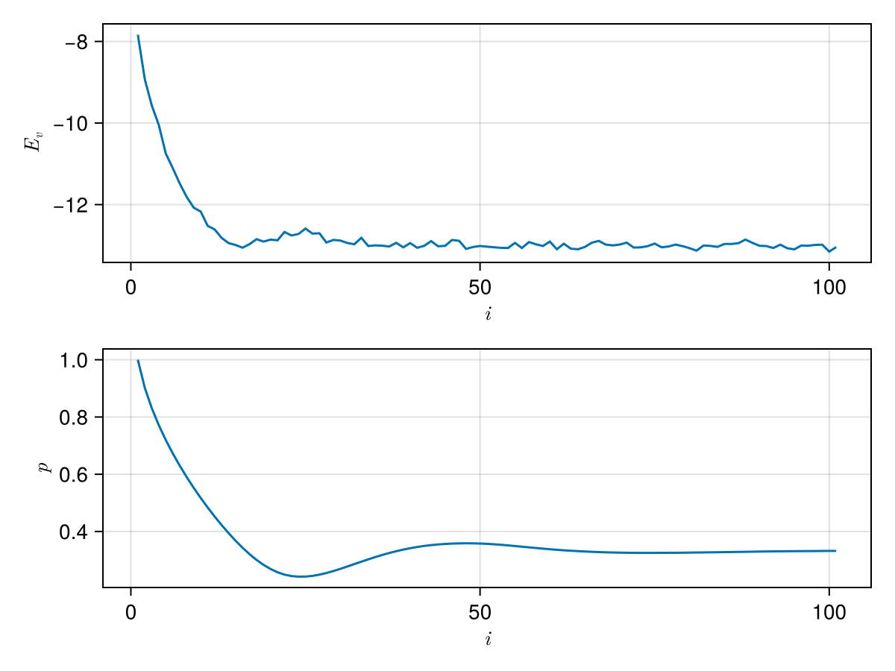
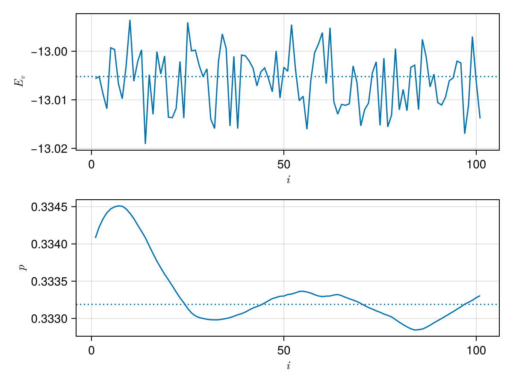

# Gutzwiller

[](https://coveralls.io/github/mtsch/Gutzwiller.jl?branch=master)

_importance sampling and variational Monte Carlo for
[Rimu.jl](https://github.com/joachimbrand/Rimu.jl)_

## Installation

Gutzwiller.jl is not yet registered. To install it, run

```julia
import Pkg; Pkg.add("https://github.com/mtsch/Gutzwiller.jl")
```

## Usage guide

````julia
using Rimu
using Gutzwiller
using CairoMakie
using LaTeXStrings
````

First, we set up a starting address and a Hamiltonian

````julia
addr = near_uniform(BoseFS{10,10})
H = HubbardReal1D(addr; u=2.0)
````

````
HubbardReal1D(fs"|1 1 1 1 1 1 1 1 1 1⟩"; u=2.0, t=1.0)
````

In this example, we'll set up a Gutzwiller ansatz to importance-sample the Hamiltonian.

````julia
ansatz = GutzwillerAnsatz(H)
````

````
GutzwillerAnsatz{BoseFS{10, 10, BitString{19, 1, UInt32}}, Float64, HubbardReal1D{Float64, BoseFS{10, 10, BitString{19, 1, UInt32}}, 2.0, 1.0}}(HubbardReal1D(fs"|1 1 1 1 1 1 1 1 1 1⟩"; u=2.0, t=1.0))
````

An ansatz is a struct that given a set of parameters and an address, produces the value
it would have if it was a vector.

````julia
ansatz(addr, [1.0])
````

````
1.0
````

In addition, the function `val_and_grad` can be used to compute both the value and its
gradient with respect to the parameters.

````julia
val_and_grad(ansatz, addr, [1.0])
````

````
(1.0, [-0.0])
````

### Deterministic optimization

For effective importance sampling, we want the ansatz to be as good of an approximation to
the ground state of the Hamiltonian as possible. As the value of the Rayleigh quotient of
a given ansatz is always larger than the Hamiltonian's ground state energy, we can use
an optimization algorithm to find the paramters that minimize its energy.

When the basis of the Hamiltonian is small enough to fit into memory, it's best to use the
`LocalEnergyEvaluator`

````julia
le = LocalEnergyEvaluator(H, ansatz)
````

````
LocalEnergyEvaluator(HubbardReal1D(fs"|1 1 1 1 1 1 1 1 1 1⟩"; u=2.0, t=1.0), GutzwillerAnsatz{BoseFS{10, 10, BitString{19, 1, UInt32}}, Float64, HubbardReal1D{Float64, BoseFS{10, 10, BitString{19, 1, UInt32}}, 2.0, 1.0}}(HubbardReal1D(fs"|1 1 1 1 1 1 1 1 1 1⟩"; u=2.0, t=1.0)))
````

which can be used to evaulate the value of the Rayleigh quotient (or its gradient) for
given parameters. In the case of the Gutzwiller ansatz, there is only one parameter.

````julia
le([1.0])
````

````
-7.825819465042905
````

Like before, we can use `val_and_grad` to also evaluate its gradient.

````julia
val_and_grad(le, [1.0])
````

````
(-7.825819465042905, [10.614147776166838])
````

Now, let's plot the energy landscape for this particular case

````julia
begin
    fig = Figure()
    ax = Axis(fig[1, 1]; xlabel=L"p", ylabel=L"E")
    ps = range(0, 2; length=100)
    Es = [le([p]) for p in ps]
    lines!(ax, ps, Es)
    fig
end
````


To find the minimum, pass `le` to `optimize` from Optim.jl

````julia
using Optim

opt_nelder = optimize(le, [1.0])
````

````
 * Status: success

 * Candidate solution
    Final objective value:     -1.300521e+01

 * Found with
    Algorithm:     Nelder-Mead

 * Convergence measures
    √(Σ(yᵢ-ȳ)²)/n ≤ 1.0e-08

 * Work counters
    Seconds run:   0  (vs limit Inf)
    Iterations:    11
    f(x) calls:    25

````

To take advantage of the gradients, wrap the evaluator in `Optim.only_fg!`. This will
usually reduce the number of steps needed to reach the minimum.

````julia
opt_lbgfs = optimize(Optim.only_fg!(le), [1.0])
````

````
 * Status: success

 * Candidate solution
    Final objective value:     -1.300521e+01

 * Found with
    Algorithm:     L-BFGS

 * Convergence measures
    |x - x'|               = 4.19e-05 ≰ 0.0e+00
    |x - x'|/|x'|          = 1.26e-04 ≰ 0.0e+00
    |f(x) - f(x')|         = 5.04e-08 ≰ 0.0e+00
    |f(x) - f(x')|/|f(x')| = 3.87e-09 ≰ 0.0e+00
    |g(x)|                 = 4.79e-09 ≤ 1.0e-08

 * Work counters
    Seconds run:   0  (vs limit Inf)
    Iterations:    5
    f(x) calls:    16
    ∇f(x) calls:   16

````

We can inspect the parameters and the value at the minimum as

````julia
opt_lbgfs.minimizer, opt_lbgfs.minimum
````

````
([0.3331889106872666], -13.005208186380349)
````

### Variational quantum Monte Carlo

When the Hamiltonian is too large to store its full basis in memory, we can use
variational QMC to sample addresses from the Hilbert space and evaluate their energy
at the same time. An important paramter we have tune is the number `steps`. More steps
will give us a better approximation of the energy, but take longer to evaluate.
Not taking enough samples can also result in producing a biased result.
Consider the following.

````julia
p0 = [1.0]
@time kinetic_vqmc(H, ansatz, p0; steps=1e2)
````

````
KineticVQMCResult
  walkers:      24
  samples:      2400
  local energy: -7.7167 ± 0.081513
````

````julia
@time kinetic_vqmc(H, ansatz, p0; steps=1e5)
````

````
KineticVQMCResult
  walkers:      24
  samples:      2400000
  local energy: -7.8291 ± 0.0033925
````

````julia
@time kinetic_vqmc(H, ansatz, p0; steps=1e7)
````

````
KineticVQMCResult
  walkers:      24
  samples:      240000000
  local energy: -7.8259 ± 0.00034744
````

For this simple example, `1e2` steps gives an energy that is significantly higher, while
`1e7` takes too long. `1e5` seems to work well enough. For more convenient evaluation, we
wrap VQMC into a struct that behaves much like the `LocalEnergyEvaluator`.

````julia
qmc = KineticVQMC(H, ansatz; samples=1e4)
````

````
KineticVQMC(
  HubbardReal1D(fs"|1 1 1 1 1 1 1 1 1 1⟩"; u=2.0, t=1.0),
  GutzwillerAnsatz{BoseFS{10, 10, BitString{19, 1, UInt32}}, Float64, HubbardReal1D{Float64, BoseFS{10, 10, BitString{19, 1, UInt32}}, 2.0, 1.0}}(HubbardReal1D(fs"|1 1 1 1 1 1 1 1 1 1⟩"; u=2.0, t=1.0));
  steps=417,
  walkers=24,
)
````

````julia
qmc([1.0]), le([1.0])
````

````
(-7.764278136564674, -7.825819465042905)
````

Because the output of this procedure is noisy, optimizing it with Optim.jl will not work.
However, we can use a stochastic gradient descent (in this case
[AMSGrad](https://paperswithcode.com/method/amsgrad)).

````julia
grad_result = amsgrad(qmc, [1.0])
````

````
GradientDescentResult
  iterations: 101
  converged: false (iterations)
  last value: -12.959814613812123
  last params: [0.3341375361174239]
````

While `amsgrad` attempts to determine if the optimization converged, it will generally not
detect convergence due to the noise in the QMC evaluation. The best way to determine
convergence is to plot the results. `grad_result` can be converted to a `DataFrame`.

````julia
grad_df = DataFrame(grad_result)
````

````
101×10 DataFrame
 Row │ α        β1       β2       iter   param       value      gradient       first_moment   second_moment  param_delta
     │ Float64  Float64  Float64  Int64  SArray…     Float64    SArray…        SArray…        SArray…        SArray…
─────┼──────────────────────────────────────────────────────────────────────────────────────────────────────────────────────
   1 │    0.01      0.1     0.01      1  [1.0]        -7.8517   [10.5681]      [10.4915]      [1.11685]      [-0.0992753]
   2 │    0.01      0.1     0.01      2  [0.900725]   -8.81397  [10.3845]      [10.4808]      [2.18406]      [-0.0709192]
   3 │    0.01      0.1     0.01      3  [0.829805]   -9.64972  [10.1503]      [10.4478]      [3.19251]      [-0.0584734]
   4 │    0.01      0.1     0.01      4  [0.771332]  -10.1564   [9.68553]      [10.3716]      [4.09868]      [-0.0512297]
   5 │    0.01      0.1     0.01      5  [0.720102]  -10.57     [8.64895]      [10.1993]      [4.80574]      [-0.0465254]
   6 │    0.01      0.1     0.01      6  [0.673577]  -11.101    [8.60619]      [10.04]        [5.49834]      [-0.0428171]
   7 │    0.01      0.1     0.01      7  [0.63076]   -11.4535   [8.08636]      [9.84463]      [6.09725]      [-0.0398687]
   8 │    0.01      0.1     0.01      8  [0.590891]  -11.7732   [7.72568]      [9.63273]      [6.63314]      [-0.0374016]
   9 │    0.01      0.1     0.01      9  [0.55349]   -12.0944   [7.30056]      [9.39952]      [7.09979]      [-0.0352763]
  10 │    0.01      0.1     0.01     10  [0.518213]  -12.2247   [6.44683]      [9.10425]      [7.44441]      [-0.0333679]
  11 │    0.01      0.1     0.01     11  [0.484845]  -12.5246   [5.86906]      [8.78073]      [7.71443]      [-0.0316139]
  12 │    0.01      0.1     0.01     12  [0.453231]  -12.6774   [4.88452]      [8.39111]      [7.87587]      [-0.0298999]
  13 │    0.01      0.1     0.01     13  [0.423331]  -12.7854   [4.02343]      [7.95434]      [7.95899]      [-0.0281952]
  14 │    0.01      0.1     0.01     14  [0.395136]  -12.9317   [2.98377]      [7.45728]      [7.96843]      [-0.0264177]
  15 │    0.01      0.1     0.01     15  [0.368719]  -12.9544   [1.76278]      [6.88783]      [7.96843]      [-0.0244004]
  16 │    0.01      0.1     0.01     16  [0.344318]  -12.9194   [0.445011]     [6.24355]      [7.96843]      [-0.022118]
  17 │    0.01      0.1     0.01     17  [0.3222]    -12.9675   [-0.576934]    [5.5615]       [7.96843]      [-0.0197018]
  18 │    0.01      0.1     0.01     18  [0.302498]  -12.9884   [-2.00539]     [4.80481]      [7.96843]      [-0.0170212]
  19 │    0.01      0.1     0.01     19  [0.285477]  -12.8922   [-2.88221]     [4.03611]      [7.97181]      [-0.014295]
  20 │    0.01      0.1     0.01     20  [0.271182]  -12.7798   [-3.94714]     [3.23778]      [8.0479]       [-0.0114132]
  21 │    0.01      0.1     0.01     21  [0.259769]  -12.9013   [-4.77098]     [2.43691]      [8.19504]      [-0.00851263]
  22 │    0.01      0.1     0.01     22  [0.251256]  -12.7883   [-5.93092]     [1.60013]      [8.46485]      [-0.00549977]
  23 │    0.01      0.1     0.01     23  [0.245757]  -12.7912   [-6.41241]     [0.798872]     [8.79139]      [-0.00269432]
  24 │    0.01      0.1     0.01     24  [0.243062]  -12.8012   [-6.5577]      [0.0632146]    [9.13351]      [-0.00020917]
  25 │    0.01      0.1     0.01     25  [0.242853]  -12.6994   [-7.16865]     [-0.659972]    [9.55607]      [0.00213494]
  26 │    0.01      0.1     0.01     26  [0.244988]  -12.7609   [-6.02553]     [-1.19653]     [9.82358]      [0.00381758]
  27 │    0.01      0.1     0.01     27  [0.248806]  -12.7231   [-6.64482]     [-1.74136]     [10.1669]      [0.00546127]
  28 │    0.01      0.1     0.01     28  [0.254267]  -12.8143   [-5.57447]     [-2.12467]     [10.376]       [0.00659594]
  29 │    0.01      0.1     0.01     29  [0.260863]  -12.6247   [-5.8031]      [-2.49251]     [10.609]       [0.00765245]
  30 │    0.01      0.1     0.01     30  [0.268515]  -12.9275   [-4.11193]     [-2.65445]     [10.6719]      [0.00812556]
  31 │    0.01      0.1     0.01     31  [0.276641]  -12.9529   [-3.5771]      [-2.74672]     [10.6932]      [0.00839964]
  32 │    0.01      0.1     0.01     32  [0.285041]  -12.8441   [-3.32014]     [-2.80406]     [10.6965]      [0.00857367]
  33 │    0.01      0.1     0.01     33  [0.293614]  -12.9499   [-1.99052]     [-2.72271]     [10.6965]      [0.00832492]
  34 │    0.01      0.1     0.01     34  [0.301939]  -12.9249   [-2.05429]     [-2.65586]     [10.6965]      [0.00812055]
  35 │    0.01      0.1     0.01     35  [0.31006]   -13.0387   [-1.10435]     [-2.50071]     [10.6965]      [0.00764616]
  36 │    0.01      0.1     0.01     36  [0.317706]  -12.9058   [-1.14945]     [-2.36559]     [10.6965]      [0.007233]
  37 │    0.01      0.1     0.01     37  [0.324939]  -12.9008   [-0.784072]    [-2.20743]     [10.6965]      [0.00674943]
  38 │    0.01      0.1     0.01     38  [0.331688]  -13.017    [0.014757]     [-1.98522]     [10.6965]      [0.00606998]
  39 │    0.01      0.1     0.01     39  [0.337758]  -13.0489   [0.431095]     [-1.74358]     [10.6965]      [0.00533117]
  40 │    0.01      0.1     0.01     40  [0.343089]  -12.9353   [0.543217]     [-1.5149]      [10.6965]      [0.00463196]
  41 │    0.01      0.1     0.01     41  [0.347721]  -12.9249   [0.256665]     [-1.33775]     [10.6965]      [0.00409028]
  42 │    0.01      0.1     0.01     42  [0.351812]  -12.9855   [1.19472]      [-1.0845]      [10.6965]      [0.00331596]
  43 │    0.01      0.1     0.01     43  [0.355128]  -12.9889   [1.22405]      [-0.853646]    [10.6965]      [0.0026101]
  44 │    0.01      0.1     0.01     44  [0.357738]  -12.9676   [1.81621]      [-0.58666]     [10.6965]      [0.00179377]
  45 │    0.01      0.1     0.01     45  [0.359532]  -13.0389   [1.69995]      [-0.357999]    [10.6965]      [0.00109462]
  46 │    0.01      0.1     0.01     46  [0.360626]  -12.9846   [1.79403]      [-0.142796]    [10.6965]      [0.000436613]
  47 │    0.01      0.1     0.01     47  [0.361063]  -13.0172   [1.897]        [0.0611831]    [10.6965]      [-0.000187073]
  48 │    0.01      0.1     0.01     48  [0.360876]  -13.018    [1.95182]      [0.250246]     [10.6965]      [-0.000765151]
  49 │    0.01      0.1     0.01     49  [0.360111]  -12.955    [1.2156]       [0.346781]     [10.6965]      [-0.00106032]
  50 │    0.01      0.1     0.01     50  [0.35905]   -13.0011   [1.44412]      [0.456515]     [10.6965]      [-0.00139584]
  51 │    0.01      0.1     0.01     51  [0.357654]  -13.0055   [1.69032]      [0.579896]     [10.6965]      [-0.00177308]
  52 │    0.01      0.1     0.01     52  [0.355881]  -12.9531   [1.18625]      [0.640531]     [10.6965]      [-0.00195848]
  53 │    0.01      0.1     0.01     53  [0.353923]  -13.0302   [1.12235]      [0.688712]     [10.6965]      [-0.0021058]
  54 │    0.01      0.1     0.01     54  [0.351817]  -12.9214   [0.860403]     [0.705881]     [10.6965]      [-0.0021583]
  55 │    0.01      0.1     0.01     55  [0.349659]  -13.035    [0.972663]     [0.73256]      [10.6965]      [-0.00223987]
  56 │    0.01      0.1     0.01     56  [0.347419]  -13.0992   [1.17143]      [0.776447]     [10.6965]      [-0.00237406]
  57 │    0.01      0.1     0.01     57  [0.345045]  -13.0368   [1.16839]      [0.815641]     [10.6965]      [-0.0024939]
  58 │    0.01      0.1     0.01     58  [0.342551]  -13.0096   [0.526658]     [0.786743]     [10.6965]      [-0.00240554]
  59 │    0.01      0.1     0.01     59  [0.340145]  -13.0312   [0.573331]     [0.765402]     [10.6965]      [-0.00234029]
  60 │    0.01      0.1     0.01     60  [0.337805]  -13.1102   [0.683714]     [0.757233]     [10.6965]      [-0.00231531]
  61 │    0.01      0.1     0.01     61  [0.33549]   -13.0502   [0.574572]     [0.738967]     [10.6965]      [-0.00225946]
  62 │    0.01      0.1     0.01     62  [0.33323]   -12.9879   [0.219047]     [0.686975]     [10.6965]      [-0.00210049]
  63 │    0.01      0.1     0.01     63  [0.33113]   -13.0849   [0.269882]     [0.645266]     [10.6965]      [-0.00197296]
  64 │    0.01      0.1     0.01     64  [0.329157]  -12.9193   [-0.2817]      [0.552569]     [10.6965]      [-0.00168953]
  65 │    0.01      0.1     0.01     65  [0.327467]  -13.0491   [-0.243852]    [0.472927]     [10.6965]      [-0.00144602]
  66 │    0.01      0.1     0.01     66  [0.326021]  -12.9892   [-0.718302]    [0.353804]     [10.6965]      [-0.00108179]
  67 │    0.01      0.1     0.01     67  [0.32494]   -13.0694   [-0.119883]    [0.306435]     [10.6965]      [-0.000936954]
  68 │    0.01      0.1     0.01     68  [0.324003]  -13.0568   [-0.29773]     [0.246019]     [10.6965]      [-0.000752225]
  69 │    0.01      0.1     0.01     69  [0.32325]   -13.0144   [-0.312828]    [0.190134]     [10.6965]      [-0.000581353]
  70 │    0.01      0.1     0.01     70  [0.322669]  -13.0241   [-0.452879]    [0.125833]     [10.6965]      [-0.000384745]
  71 │    0.01      0.1     0.01     71  [0.322284]  -13.0181   [-0.920708]    [0.0211788]    [10.6965]      [-6.47561e-5]
  72 │    0.01      0.1     0.01     72  [0.32222]   -13.0224   [-0.619517]    [-0.0428908]   [10.6965]      [0.000131143]
  73 │    0.01      0.1     0.01     73  [0.322351]  -13.0043   [-0.317985]    [-0.0704002]   [10.6965]      [0.000215255]
  74 │    0.01      0.1     0.01     74  [0.322566]  -13.0609   [-0.460166]    [-0.109377]    [10.6965]      [0.000334429]
  75 │    0.01      0.1     0.01     75  [0.3229]    -12.9247   [-0.738369]    [-0.172276]    [10.6965]      [0.00052675]
  76 │    0.01      0.1     0.01     76  [0.323427]  -13.0772   [-0.548139]    [-0.209862]    [10.6965]      [0.000641673]
  77 │    0.01      0.1     0.01     77  [0.324069]  -13.102    [-0.227004]    [-0.211576]    [10.6965]      [0.000646914]
  78 │    0.01      0.1     0.01     78  [0.324716]  -12.9948   [-0.16287]     [-0.206706]    [10.6965]      [0.000632022]
  79 │    0.01      0.1     0.01     79  [0.325348]  -13.0316   [-0.117584]    [-0.197794]    [10.6965]      [0.000604772]
  80 │    0.01      0.1     0.01     80  [0.325952]  -13.0189   [-0.46716]     [-0.22473]     [10.6965]      [0.000687133]
  81 │    0.01      0.1     0.01     81  [0.32664]   -13.0443   [-0.257545]    [-0.228012]    [10.6965]      [0.000697166]
  82 │    0.01      0.1     0.01     82  [0.327337]  -13.0766   [-0.133085]    [-0.218519]    [10.6965]      [0.000668142]
  83 │    0.01      0.1     0.01     83  [0.328005]  -13.0219   [-0.160378]    [-0.212705]    [10.6965]      [0.000650365]
  84 │    0.01      0.1     0.01     84  [0.328655]  -13.0371   [-0.00947678]  [-0.192382]    [10.6965]      [0.000588226]
  85 │    0.01      0.1     0.01     85  [0.329243]  -12.9564   [-0.105346]    [-0.183679]    [10.6965]      [0.000561614]
  86 │    0.01      0.1     0.01     86  [0.329805]  -13.0115   [0.0302974]    [-0.162281]    [10.6965]      [0.000496189]
  87 │    0.01      0.1     0.01     87  [0.330301]  -13.0708   [0.169606]     [-0.129092]    [10.6965]      [0.000394711]
  88 │    0.01      0.1     0.01     88  [0.330696]  -13.0239   [-0.0109219]   [-0.117275]    [10.6965]      [0.00035858]
  89 │    0.01      0.1     0.01     89  [0.331055]  -13.0459   [-0.131932]    [-0.118741]    [10.6965]      [0.000363061]
  90 │    0.01      0.1     0.01     90  [0.331418]  -12.9393   [-0.141194]    [-0.120986]    [10.6965]      [0.000369927]
  91 │    0.01      0.1     0.01     91  [0.331788]  -13.0257   [-0.113008]    [-0.120188]    [10.6965]      [0.000367487]
  92 │    0.01      0.1     0.01     92  [0.332155]  -12.957    [-0.186209]    [-0.126791]    [10.6965]      [0.000387674]
  93 │    0.01      0.1     0.01     93  [0.332543]  -13.0154   [0.201128]     [-0.0939986]   [10.6965]      [0.000287409]
  94 │    0.01      0.1     0.01     94  [0.33283]   -12.8957   [-0.622455]    [-0.146844]    [10.6965]      [0.00044899]
  95 │    0.01      0.1     0.01     95  [0.333279]  -12.9735   [0.107338]     [-0.121426]    [10.6965]      [0.000371271]
  96 │    0.01      0.1     0.01     96  [0.33365]   -13.0728   [0.212622]     [-0.0880212]   [10.6965]      [0.000269133]
  97 │    0.01      0.1     0.01     97  [0.33392]   -13.0786   [0.183407]     [-0.0608785]   [10.6965]      [0.000186141]
  98 │    0.01      0.1     0.01     98  [0.334106]  -13.0088   [0.109653]     [-0.0438253]   [10.6965]      [0.000134]
  99 │    0.01      0.1     0.01     99  [0.33424]   -13.0209   [0.327876]     [-0.00665525]  [10.6965]      [2.0349e-5]
 100 │    0.01      0.1     0.01    100  [0.33426]   -13.0733   [0.460508]     [0.040061]     [10.6965]      [-0.00012249]
 101 │    0.01      0.1     0.01    101  [0.334138]  -12.9598   [0.517111]     [0.087766]     [10.6965]      [-0.000268353]
````

To plot it, we can either work with the `DataFrame` or access the fields directly

````julia
begin
    fig = Figure()
    ax1 = Axis(fig[1, 1]; xlabel=L"i", ylabel=L"E_v")
    ax2 = Axis(fig[2, 1]; xlabel=L"i", ylabel=L"p")

    lines!(ax1, grad_df.iter, grad_df.value)
    lines!(ax2, first.(grad_result.param))
    fig
end
````


We see from the plot that the value of the energy is fluctiating around what appears to be
the minimum. While the parameter estimate here is probably good enough for importance
sampling, we can refine the result by creating a new `KineticVQMC` structure with
increased samples and use it to refine the result.

````julia
qmc2 = KineticVQMC(H, ansatz; samples=1e6)
grad_result2 = amsgrad(qmc2, grad_result.param[end])
````

````
GradientDescentResult
  iterations: 101
  converged: false (iterations)
  last value: -13.01330709959126
  last params: [0.33239805300127506]
````

Now, let's plot the refined result next to the minimum found by Optim.jl

````julia
begin
    fig = Figure()
    ax1 = Axis(fig[1, 1]; xlabel=L"i", ylabel=L"E_v")
    ax2 = Axis(fig[2, 1]; xlabel=L"i", ylabel=L"p")

    lines!(ax1, grad_result2.value)
    hlines!(ax1, [opt_lbgfs.minimum]; linestyle=:dot)
    lines!(ax2, first.(grad_result2.param))
    hlines!(ax2, opt_lbgfs.minimizer; linestyle=:dot)
    fig
end
````


### Importance sampling

Finally, we have a good estimate for the parameter to use with importance
sampling. Gutzwiller.jl provides `AnsatzSampling`, which is similar to
`GutzwillerSampling` from Rimu, but can be used with different ansatze.

````julia
p = grad_result.param[end]
G = AnsatzSampling(H, ansatz, p)
````

````
AnsatzSampling{Float64, 1, GutzwillerAnsatz{BoseFS{10, 10, BitString{19, 1, UInt32}}, Float64, HubbardReal1D{Float64, BoseFS{10, 10, BitString{19, 1, UInt32}}, 2.0, 1.0}}, HubbardReal1D{Float64, BoseFS{10, 10, BitString{19, 1, UInt32}}, 2.0, 1.0}}(HubbardReal1D(fs"|1 1 1 1 1 1 1 1 1 1⟩"; u=2.0, t=1.0), GutzwillerAnsatz{BoseFS{10, 10, BitString{19, 1, UInt32}}, Float64, HubbardReal1D{Float64, BoseFS{10, 10, BitString{19, 1, UInt32}}, 2.0, 1.0}}(HubbardReal1D(fs"|1 1 1 1 1 1 1 1 1 1⟩"; u=2.0, t=1.0)), [0.3341375361174239])
````

This can now be used with FCIQMC. Let's compare the importance sampled time series to a
non-importance sampled one.

````julia

prob_standard = ProjectorMonteCarloProblem(H; target_walkers=15, last_step=2000)
sim_standard = solve(prob_standard)
shift_estimator(sim_standard; skip=1000)
````

````
BlockingResult{Float64}
  mean = -10.14 ± 0.59
  with uncertainty of ± 0.07654551002905478
  from 31 blocks after 5 transformations (k = 6).

````

````julia
prob_sampled = ProjectorMonteCarloProblem(G; target_walkers=15, last_step=2000)
sim_sampled = solve(prob_sampled)
shift_estimator(sim_sampled; skip=1000)
````

````
BlockingResult{Float64}
  mean = -12.36 ± 0.38
  with uncertainty of ± 0.0345891146330015
  from 62 blocks after 4 transformations (k = 5).

````

Note that the lower energy estimate in the sampled case is probably due to a reduced
population control bias. The effect importance sampling has on the statistic can be more
dramatic for larger systems and beter choices of anstaze.

---

*This page was generated using [Literate.jl](https://github.com/fredrikekre/Literate.jl).*
